# SubQuick 详细设计文档

> **技术栈：** Flet (GUI) + PyInstaller (打包)
> **版本：** v1.0 (设计阶段)
> **最后更新：** 2026-06-28

---

## 目录

1. [需求分析](#1-需求分析)
2. [用户操作流程](#2-用户操作流程)
3. [代码目录设计](#3-代码目录设计)
4. [架构设计](#4-架构设计)
5. [界面主题与配色设计](#5-界面主题与配色设计)
6. [交互逻辑设计](#6-交互逻辑设计)
7. [测试设计](#7-测试设计)
8. [版权与授权设计](#8-版权与授权设计)
9. [开发方案设计](#9-开发方案设计)
10. [更新设计](#10-更新设计)
11. [数据库设计](#11-数据库设计)
12. [安全设计](#12-安全设计)
13. [错误处理与异常设计](#13-错误处理与异常设计)
14. [日志与监控设计](#14-日志与监控设计)
15. [项目命名规范](#15-项目命名规范)
16. [交互设计（界面原型详述）](#16-交互设计界面原型详述)

---

## 1. 需求分析

### 1.1 核心需求

| ID | 需求 | 优先级 | 说明 |
|----|------|--------|------|
| R01 | 设置本地视频目录 | P0 | 用户选择一个或多个文件夹作为扫描目标 |
| R02 | 递归扫描视频文件 | P0 | 遍历所选目录及其所有子目录 |
| R03 | 展示视频详情列表 | P0 | 列表包含：所在目录、文件名、文件大小、视频格式、时长等 |
| R04 | 字幕缺失检测 | P0 | 自动检测视频同级目录是否存在同名字幕文件 |
| R05 | 一键在线匹配字幕 | P0 | 基于文件名自动搜索并下载最优字幕 |
| R06 | 自动保存到视频目录 | P0 | 下载的字幕自动保存到视频文件同级目录 |
| R07 | 扫描进度展示 | P0 | 扫描过程中显示实时进度条 |
| R08 | 匹配下载进度展示 | P0 | 下载过程中显示实时进度条 |
| R09 | 设置单视频匹配字幕数 | P0 | 用户可设置 1~5，控制每个视频下载几个字幕文件 |
| R10 | 字幕语言优先级设置 | P0 | 用户首选语言 → 汉语 → 英语，逐级降级匹配 |
| R11 | 多字幕源支持（扩展） | P1 | 设计插件式架构，支持 OpenSubtitles 等 |

### 1.2 用户未明示但应补充的需求

| ID | 需求 | 优先级 | 理由 |
|----|------|--------|------|
| R12 | 支持手动搜索字幕 | P1 | 自动匹配结果不满意时，用户可手动输入关键词搜索 |
| R13 | 下载历史记录 | P1 | 记录已下载过哪些字幕，避免重复下载 |
| R14 | 支持的文件格式配置 | P1 | 默认 mp4/mkv/avi/mov/wmv，允许用户增删 |
| R15 | 代理设置 | P2 | 部分网络环境下需要代理才能访问字幕 API |
| R16 | 暂停/继续下载 | P2 | 大量视频匹配时可暂停，下次继续 |
| R17 | 字幕预览 | P2 | 下载前可预览字幕内容的前几行 |
| R18 | 导出缺失列表 | P2 | 将缺失字幕的视频列表导出为 CSV/TXT |
| R19 | 自动语言降级提示 | P1 | 当未找到用户首选语言时，提示降级策略 |
| R20 | 应用多开限制 | P2 | 防止同时运行多个实例导致冲突 |
| R21 | 首次运行引导 | P1 | 首次启动时引导用户设置目录和 API Key |
| R22 | 视频筛选与排序 | P1 | 支持按格式、大小、时长排序和筛选 |
| R23 | 忽略列表 | P2 | 用户可将某些文件夹/文件加入忽略列表，不扫描 |
| R24 | 自动更新检查 | P2 | 启动时检查 GitHub Release 是否有新版本 |

### 1.3 需求全景图

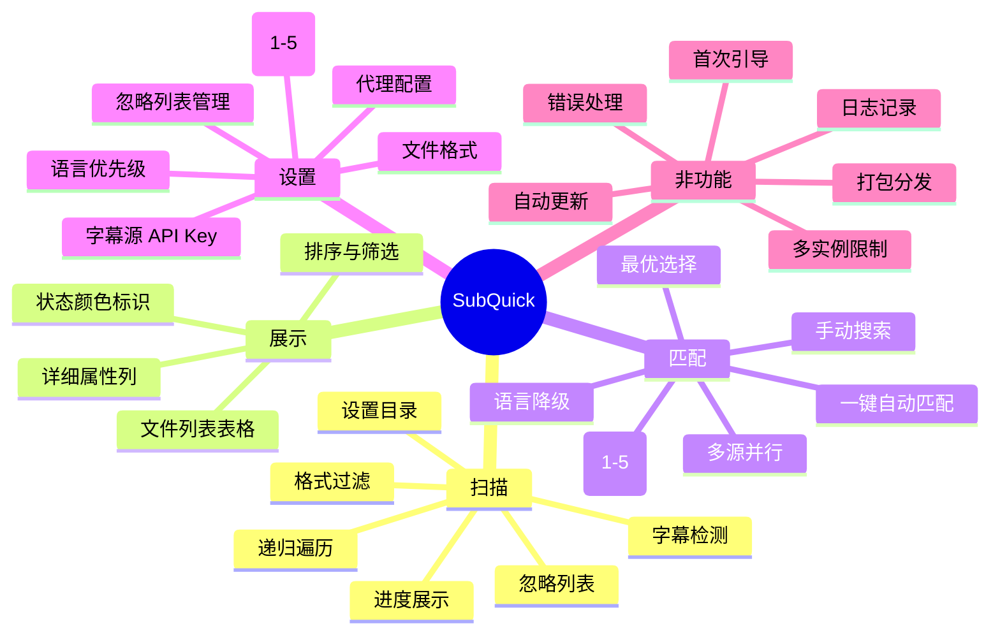

---

## 2. 用户操作流程

### 2.1 主流程

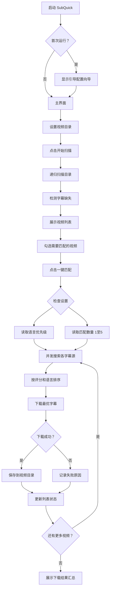

### 2.2 设置页面流程

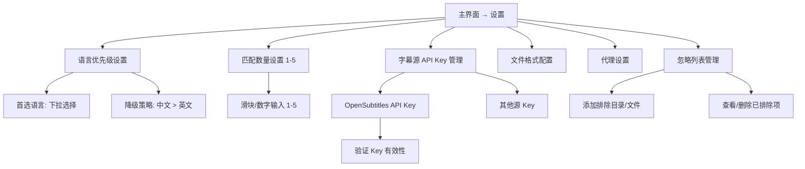

### 2.3 手动搜索流程

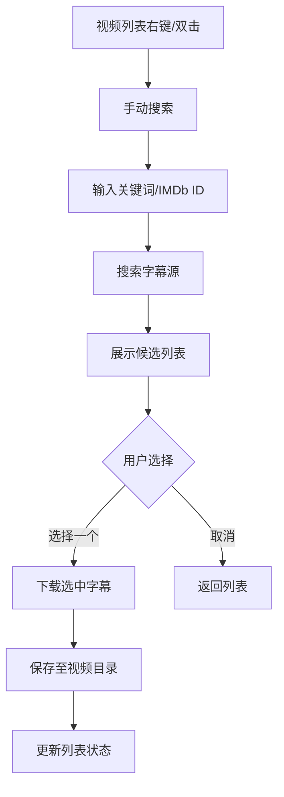

---

## 3. 代码目录设计

```
SubQuick/
│
├── main.py                          # 应用入口，flet.run()
│
├── app/                             # 核心应用代码
│   ├── __init__.py
│   │
│   ├── ui/                          # UI 层（Flet 页面与控件）
│   │   ├── __init__.py
│   │   ├── app.py                   # Flet 应用主类
│   │   ├── pages/
│   │   │   ├── __init__.py
│   │   │   ├── main_page.py         # 主页面（扫描+列表+下载）
│   │   │   ├── settings_page.py     # 设置页面
│   │   │   └── wizard_page.py       # 首次引导页面
│   │   ├── components/
│   │   │   ├── __init__.py
│   │   │   ├── video_table.py       # 视频列表 DataTable 组件
│   │   │   ├── progress_panel.py    # 进度条面板组件
│   │   │   ├── search_dialog.py     # 手动搜索对话框
│   │   │   └── status_badge.py      # 状态指示标签组件
│   │   └── theme.py                 # 主题配色定义
│   │
│   ├── scanner/                     # 扫描层（纯逻辑）
│   │   ├── __init__.py
│   │   ├── video_scanner.py         # 视频文件递归扫描
│   │   ├── subtitle_detector.py     # 字幕文件检测
│   │   └── file_filter.py           # 文件格式过滤 + 忽略列表
│   │
│   ├── downloader/                  # 下载层（字幕源适配器）
│   │   ├── __init__.py
│   │   ├── base.py                  # 抽象基类 BaseProvider
│   │   ├── opensubtitles.py         # OpenSubtitles.com API v2
│   │   └── manager.py               # 下载管理器（调度、队列、并发）
│   │
│   ├── matcher/                     # 匹配层
│   │   ├── __init__.py
│   │   ├── subtitle_matcher.py      # 字幕自动选择算法
│   │   └── language_priority.py     # 语言降级策略
│   │
│   ├── models/                      # 数据模型
│   │   ├── __init__.py
│   │   ├── video.py                 # VideoFile 数据类
│   │   ├── subtitle.py             # SubtitleInfo 数据类
│   │   ├── task.py                  # DownloadTask 数据类
│   │   └── settings.py             # 用户设置模型
│   │
│   ├── services/                    # 业务服务层
│   │   ├── __init__.py
│   │   ├── scan_service.py          # 扫描业务流程
│   │   ├── download_service.py      # 下载业务流程
│   │   └── settings_service.py      # 设置读写
│   │
│   └── utils/                       # 工具函数
│       ├── __init__.py
│       ├── file_utils.py            # 文件操作工具
│       ├── network.py               # 网络请求 + 代理
│       └── hasher.py               # 计算视频文件 hash
│
├── config/                          # 运行配置
│   ├── default_settings.json        # 默认设置
│   └── user_settings.json           # 用户设置（运行时生成）
│
├── resources/                       # 静态资源
│   ├── icon.png                     # 应用图标
│   ├── icon.ico                     # Windows 图标
│   └── logo.png                     # 应用内 logo
│
├── tests/                           # 测试
│   ├── __init__.py
│   ├── unit/
│   │   ├── test_scanner.py
│   │   ├── test_matcher.py
│   │   ├── test_file_filter.py
│   │   └── test_language_priority.py
│   ├── integration/
│   │   ├── test_opensubtitles.py
│   │   └── test_download_flow.py
│   └── conftest.py
│
├── docs/                            # 文档
│   └── DESIGN.md                    # 本设计文档
│
├── scripts/                         # 辅助脚本（PowerShell）
│   ├── run_dev.ps1                  # 开发运行
│   ├── build.ps1                    # PyInstaller 打包
│   ├── lint.ps1                     # 代码检查
│   └── test.ps1                     # 运行测试
│
├── build.spec                       # PyInstaller 打包配置
├── requirements.txt                 # 依赖列表
├── pyproject.toml                   # 项目元数据
├── README.md                        # 使用说明
└── LICENSE                          # 授权协议
```

---

## 4. 架构设计

### 4.1 整体分层架构

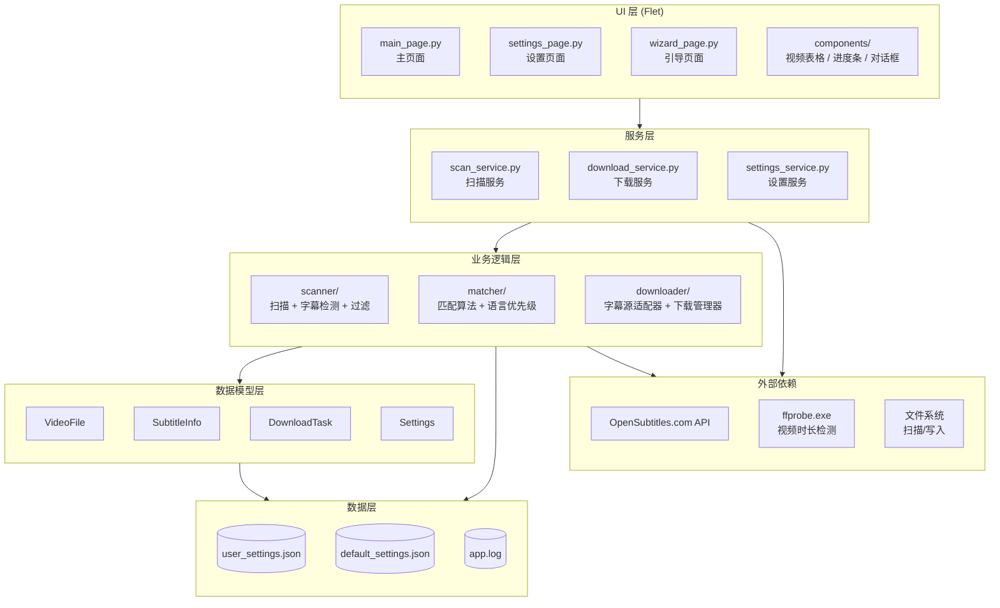

### 4.2 数据流设计

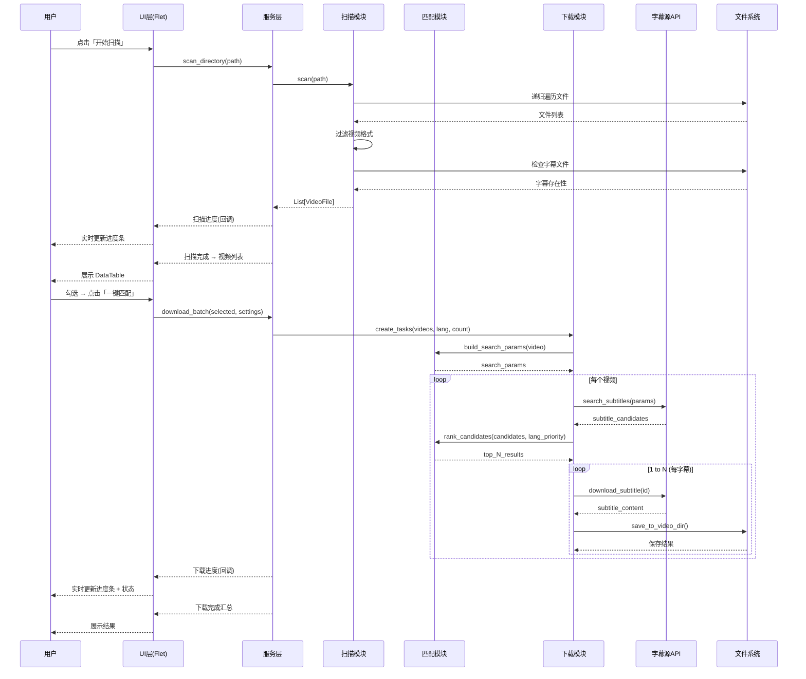

### 4.3 模块依赖关系

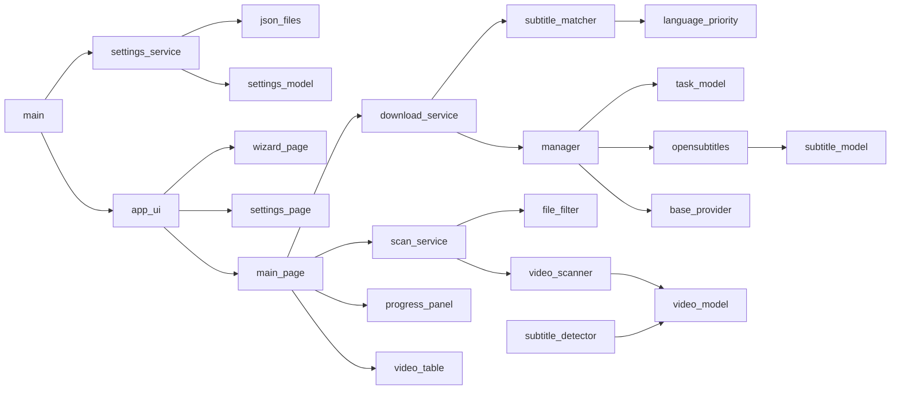

---

## 5. 界面主题与配色设计

### 5.1 设计理念

- **简洁清晰**：文件管理类工具，信息密度高但不杂乱
- **Material Design 3**：Flet 原生支持，使用 Material You 配色
- **深色/浅色模式切换**：支持三种模式 — 跟随系统、浅色、深色。用户可在设置页面随时切换，切换后即时生效无需重启
- **16:9 横向布局**：主界面采用 16:9 宽屏比例设计，充分利用主流显示器横向空间，将扫描设置、视频列表、操作进度三块内容从左到右或从上到下合理分布
- **信息层级分明**：扫描区 → 列表区 → 进度区 → 操作区 纵向排列
- **暗色优先**：默认跟随系统主题，推荐使用暗色模式（适合影音用户场景）

### 5.2 布局约束

| 约束项 | 值 | 说明 |
|--------|-----|------|
| 主窗口比例 | **16:9** | 适配主流显示器（1920×1080、2560×1440 等） |
| 最小窗口尺寸 | 1280 × 720 | 保证内容完整显示 |
| 默认窗口尺寸 | 1440 × 810 | 基于 16:9，信息密度适中 |
| 最大窗口尺寸 | 无限制 | 可全屏最大化，内容区域自适应扩展 |
| 窗口调整大小 | **支持** | 用户可拖拽窗口边缘或角任意调整大小；Flet 默认支持，所有控件使用弹性布局（`expand`）自适应 |
| 布局方向 | 纵向（垂直堆叠） | 扫描面板 → 视频列表 → 操作进度 → 状态栏 |
| 视频列表占比 | 窗口高度的 50%-60% | 作为主要信息展示区，给予最大空间 |
| 右对齐固定面板 | 设置按钮、状态栏 | 不随内容滚动

### 5.2 配色方案

| 用途 | 亮色模式 | 暗色模式 | 说明 |
|------|---------|---------|------|
| 主背景 | `#F5F5F5` | `#1E1E1E` | 页面主背景 |
| 卡片/面板 | `#FFFFFF` | `#2D2D2D` | 各功能面板背景 |
| 主色调 | `#1565C0` (蓝) | `#64B5F6` (浅蓝) | 按钮、强调元素 |
| 成功 | `#2E7D32` | `#66BB6A` | 已有字幕、下载成功 |
| 警告 | `#E65100` | `#FFA726` | 缺失字幕、需注意 |
| 错误 | `#C62828` | `#EF5350` | 下载失败 |
| 进行中 | `#1565C0` | `#42A5F5` | 进度条动画 |
| 文字主 | `#212121` | `#E0E0E0` | 主要文字 |
| 文字次 | `#757575` | `#9E9E9E` | 辅助文字 |
| 分割线 | `#E0E0E0` | `#424242` | 列表分割线 |

### 5.3 字体规范

| 用途 | 字体 | 大小 |
|------|------|------|
| 标题 | Roboto Medium | 20px |
| 列表表头 | Roboto Medium | 14px |
| 列表内容 | Roboto Regular | 13px |
| 按钮文字 | Roboto Medium | 14px |
| 状态标签 | Roboto Medium | 12px |
| 提示文字 | Roboto Regular | 12px |

### 5.4 间距规范

| 用途 | 值 |
|------|-----|
| 页面边距 | 16px |
| 面板间距 | 12px |
| 列表行间距 | 8px |
| 按钮内边距 | 水平24px 垂直12px |
| 列表单元格边距 | 8px |

### 5.5 主题模式切换

支持三种主题模式，用户可在设置页面随时切换：

| 模式 | 说明 | 实现方式 |
|------|------|---------|
| 🌗 跟随系统 | 自动适配 Windows 深色/浅色设置 | Flet `page.theme_mode = ft.ThemeMode.SYSTEM` |
| ☀️ 浅色模式 | 始终使用浅色配色 | `ft.ThemeMode.LIGHT` |
| 🌙 深色模式 | 始终使用深色配色 | `ft.ThemeMode.DARK` |

**切换行为：**
- 设置页面下拉选择后**即时生效**，无需重启应用
- 选择「跟随系统」时，Windows 切换深色/浅色后应用自动跟随
- 用户选择存储在 `user_settings.json` 的 `ui.theme` 字段中
- 下次启动时自动恢复上次选择的模式

### 5.6 图标系统

使用 **[IconPark](https://github.com/bytedance/IconPark.git)** 开源图标库（Apache-2.0 许可证，2000+ 高质量 SVG 图标），保持界面图标风格统一。

**使用方式：**

从 IconPark 仓库中提取所需图标的 SVG 文件，存放于 `resources/icons/` 目录，通过 Flet 的 `ft.Image` 控件渲染：

```python
# 示例
ft.Image(src="resources/icons/scan.svg", width=20, height=20)
ft.Image(src="resources/icons/download.svg", width=20, height=20)
```

**图标对照表（IconPark 图标名 → 功能）：**

| 功能 | IconPark 图标名 | SVG 文件名 | 建议主题 |
|------|----------------|-----------|---------|
| 扫描/搜索 | `Search` | `search.svg` | outline |
| 下载 | `Download` | `download.svg` | outline |
| 设置 | `Setting` | `setting.svg` | outline |
| 已有字幕 | `CheckCorrect` | `check-correct.svg` | filled（绿色）|
| 缺失字幕 | `Attention` | `attention.svg` | outline（橙色）|
| 下载中 | `Time` | `time.svg` | outline（蓝色）|
| 下载失败 | `CloseOne` | `close-one.svg` | filled（红色）|
| 文件夹 | `FolderOpen` | `folder-open.svg` | outline |
| 视频文件 | `Movie` 或 `Video` | `video.svg` | outline |
| 排序升序 | `SortAmountUp` | `sort-up.svg` | outline |
| 排序降序 | `SortAmountDown` | `sort-down.svg` | outline |
| 全选 | `CheckboxSelected` | `checkbox-selected.svg` | outline |
| 取消全选 | `Checkbox` | `checkbox.svg` | outline |
| 刷新 | `Refresh` | `refresh.svg` | outline |
| 清空 | `Delete` | `delete.svg` | outline |
| 暂停 | `PauseOne` | `pause-one.svg` | outline |
| 继续 | `PlayOne` | `play-one.svg` | outline |
| 返回 | `ArrowLeft` | `arrow-left.svg` | outline |
| 关于 | `Info` | `info.svg` | outline |
| 日志 | `FileText` | `file-text.svg` | outline |
| 代理 | `Earth` | `earth.svg` | outline |
| 语言 | `Translate` | `translate.svg` | outline |
| 深色模式 | `Moon` | `moon.svg` | outline |
| 浅色模式 | `Sun` | `sun.svg` | outline |
| 应用图标 | （自定义设计） | `app-icon.svg` | — |

**图标规范：**

| 属性 | 值 |
|------|-----|
| 尺寸 | 标准 20×20px，按钮图标 18×18px |
| 描边宽度 | 2px（outline 主题默认） |
| 颜色 | 跟随当前文字颜色（`currentColor`），或根据上下文使用语义色 |
| 主题 | 功能操作类使用 outline，状态指示类使用 filled |
| 源路径 | `resources/icons/`（打包时随 exe 一起分发） |

**Flet 渲染实现：**

```python
# 通用图标组件封装
class AppIcon(ft.Image):
    def __init__(self, name: str, size: int = 20, color: str = None):
        super().__init__()
        self.src = f"resources/icons/{name}.svg"
        self.width = size
        self.height = size
        self.color = color  # Flet 支持 SVG 颜色覆盖
```

---

## 6. 交互逻辑设计

### 6.1 主界面布局

```
┌────────────────────────────────────────────────────────────────────────────┐
│  SubQuick  v1.0                                                     [⚙ 设置] │
├────────────────────────────────────────────────────────────────────────────┤
│  ┌─ 扫描面板 ───────────────────────────────────────────────────────────┐  │
│  │  视频目录:  [C:\Users\...\Videos ______________________________]     │  │
│  │            [📂 浏览目录]    支持格式: MP4 MKV AVI MOV WMV  [▶ 开始扫描] │  │
│  └───────────────────────────────────────────────────────────────────────┘  │
│                                                                              │
│  ┌─ 扫描进度条 ──────────────────────────────────────────────────────────┐  │
│  │  ████████████████████░░░░░░░░░░░░░░░░░░░  60%  (300/500 个文件)       │  │
│  │  当前: D:\Movies\Subfolder\...                                        │  │
│  └───────────────────────────────────────────────────────────────────────┘  │
│                                                                              │
│  ┌─ 视频列表 ─────────────────────────────────────────────────────────────┐ │
│  │  [☐ 全选] [↕ 格式] [↕ 大小] [↕ 时长] [↕ 字幕状态]       共 50 部缺失 │ │
│  │  ┌────┬────────────────────┬──────┬───────┬──────┬──────────┬───────┐ │ │
│  │  │ ☑  │ 文件名              │ 格式  │ 大小   │ 时长  │ 字幕状态  │ 目录   │ │ │
│  │  ├────┼────────────────────┼──────┼───────┼──────┼──────────┼───────┤ │ │
│  │  │ ☑  │ Movie1.mp4         │ MP4  │ 2.1 GB│ 1h30 │ ⚠ 缺失   │ Main  │ │ │
│  │  │ ☑  │ Movie2.mkv         │ MKV  │ 4.3 GB│ 2h15 │ ⚠ 缺失   │ Sub   │ │ │
│  │  │ ☐  │ Movie3.mp4         │ MP4  │ 1.8 GB│ 1h20 │ ✓ 已存在  │ Main  │ │ │
│  │  │ ☑  │ Series_S01E01.mkv │ MKV  │ 3.5 GB│ 45m  │ ⚠ 缺失   │ TV    │ │ │
│  │  │ ☑  │ Movie4.avi         │ AVI  │ 1.2 GB│ 1h55 │ ⚠ 缺失   │ Main  │ │ │
│  │  │ ☑  │ Movie5.mov         │ MOV  │ 5.6 GB│ 2h10 │ ⚠ 缺失   │ Sub   │ │ │
│  │  └────┴────────────────────┴──────┴───────┴──────┴──────────┴───────┘ │ │
│  │  [全选] [反选] [筛选: 全部 ▾]                    已选 5 部 / 共 50 部 │ │
│  └───────────────────────────────────────────────────────────────────────┘  │
│                                                                              │
│  ┌─ 操作 / 进度面板 ────────────────────────────────────────────────────┐  │
│  │  [⬇ 一键匹配]  [📋 导出缺失列表]                字幕数/视频: [3 ▾]  │  │
│  │  ────────────────────────────────────────────────────────────────── │  │
│  │  下载进度: ████████████░░░░░░░░░░░░░░░  75%  (3/5 完成)             │  │
│  │  当前: Movie1.mp4  → 正在搜索 OpenSubtitles...                      │  │
│  │  完成: Movie2.mkv  → 已下载 3 个字幕 ✅                             │  │
│  │  完成: Series_S01E01.mkv → 已下载 2 个字幕 ✅                       │  │
│  │  失败: Movie4.avi  → 未找到匹配字幕 ⚠                              │  │
│  └──────────────────────────────────────────────────────────────────────┘  │
│                                                                              │
│  ┌─ 状态栏 ─────────────────────────────────────────────────────────────┐  │
│  │  扫描完成 | 50 部视频 | 35 部缺失字幕 | 上次匹配: 2026-06-28 12:30  │  │
│  └──────────────────────────────────────────────────────────────────────┘  │
└────────────────────────────────────────────────────────────────────────────┘
```

### 6.2 交互状态机

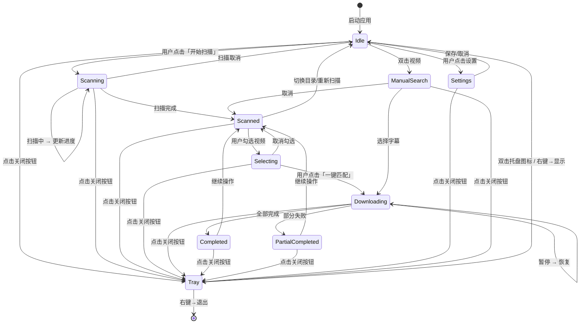

### 6.3 交互细节

| 交互 | 行为 |
|------|------|
| 交互 | 行为 |
|------|------|
| 点击「浏览目录」 | 弹出 Flet `FilePicker`，选择目录模式 |
| 输入目录路径 | 支持手动输入+粘贴，回车触发扫描 |
| 点击「开始扫描」 | 按钮变为「取消扫描」，再次点击可取消 |
| 扫描过程 | 进度条实时更新，显示当前正在扫描的文件 |
| 列表行点击 | 选中/取消选中该行 |
| 列表行双击 | 弹出「手动搜索」对话框 |
| 列头点击 | 切换该列排序（升序/降序/不排序） |
| 「全选」点击 | 选中当前筛选后的所有可见行 |
| 点击「一键匹配」 | 开始对已选视频批量匹配，按钮变为「暂停」 |
| 匹配完成后 | 视频列表对应行状态更新，按钮恢复 |
| 设置保存 | 自动写入 `user_settings.json`，无需手动保存 |
| 引导关闭 | 第一次关闭引导后不再显示 |
| 点击窗口关闭按钮 | **最小化到系统托盘**，不退出程序；托盘图标右键菜单提供「显示主窗口」「退出」选项 |
| 拖拽窗口边缘/角 | **调整窗口大小**，所有控件使用弹性布局自适应 |
| 双击托盘图标 | 显示主窗口并前置 |
| 系统托盘图标 | 显示在 Windows 通知栏，图标为 SubQuick 应用图标 |

---

## 7. 测试设计

### 7.1 单元测试

| 测试模块 | 测试内容 | 工具 |
|---------|---------|------|
| `test_video_scanner.py` | 递归扫描目录、过滤视频格式、检测字幕存在性 | pytest + tmp_path |
| `test_file_filter.py` | 格式白名单、忽略列表、排除隐藏文件 | pytest |
| `test_language_priority.py` | 语言优先级排序、降级策略（首选→中文→英文） | pytest |
| `test_subtitle_matcher.py` | 候选字幕评分、最优选择、匹配数量限制 | pytest |
| `test_settings_model.py` | 设置读写、默认值、边界值（匹配数1-5） | pytest |
| `test_network.py` | 代理配置、超时处理、请求重试 | pytest + responses |

### 7.2 集成测试

| 测试模块 | 测试内容 |
|---------|---------|
| `test_scan_to_list.py` | 扫描完成后数据模型是否正确传递给列表 |
| `test_download_flow.py` | 从选择到下载完成的全流程（mock API） |
| `test_opensubtitles.py` | 实际调用 OpenSubtitles API 验证连通性 |

### 7.3 UI 测试

Flet 目前无原生 UI 测试框架，建议：

| 方法 | 内容 |
|------|------|
| 手动测试清单 | 所有交互路径走一遍（见下方清单） |
| 截图对比 | 每次界面变更后截图，人工对比 |

### 7.4 手动测试清单

```
☐ 首次启动 → 引导页面正常展示
☐ 引导页面 → 填写 API Key → 完成 → 进入主界面
☐ 设置目录 → 点浏览 → 选择目录 → 路径显示正确
☐ 输入不存在目录 → 提示错误
☐ 点扫描 → 进度条实时更新 → 扫描完成后列表正确
☐ 扫描 500+ 文件 → 性能正常，不卡死
☐ 列表排序 → 点击各列头 → 排序正确
☐ 勾选 → 全选 → 反选 → 计数正确
☐ 点击一键匹配 → 进度条更新 → 下载完成
☐ 设置匹配数=5 → 下载后确认有5个字幕文件
☐ 网络断开时匹配 → 提示错误，列表状态更新
☐ 语言降级测试 → 首选日语不存在 → 自动降级到中文
☐ 设置页面 → 修改所有选项 → 保存 → 重新打开确认
☐ 打包 exe 在无 Python 环境运行
☐ 重复打开 → 单实例限制正常工作
☐ 日志文件正常写入
```

---

## 8. 版权与授权设计

### 8.1 项目许可证

**MIT License**

理由：
- 允许商用、修改、分发
- 与 Flet (Apache 2.0) 兼容
- 最低的限制，适合个人开源项目
- 用户不需要为使用本工具付费

### 8.2 字幕内容版权声明

```
免责声明：
SubQuick 仅提供技术工具，不托管、不存储任何字幕文件。
所有字幕内容来自第三方 API（如 OpenSubtitles.com），
版权归原作者所有。用户应仅将本工具用于合法目的，
下载受版权保护的字幕需自行确认许可。
```

在应用首次启动时展示此声明。

### 8.3 第三方依赖许可证

| 依赖 | 许可证 | 兼容性 |
|------|--------|--------|
| Flet | Apache 2.0 | ✅ |
| requests | Apache 2.0 | ✅ |
| PyInstaller | GPL 2.0 + exception | ✅（仅打包工具，不传染） |

### 8.4 署名

```
Copyright (c) 2026 PingWang
MIT License

Powered by Flet & OpenSubtitles
```

放置在应用关于页面/底部状态栏。

---

## 9. 开发方案设计

### 9.1 开发环境

| 工具 | 版本 | 说明 |
|------|------|------|
| Python | >= 3.9 | Flet 要求 |
| 虚拟环境 | venv（Python 内置） | 开发/调试/打包均在 venv 中进行 |
| Flet | 最新版 | `pip install flet` |
| PyInstaller | 最新版 | `pip install pyinstaller` |
| Git | - | 版本控制 |
| VS Code | - | 推荐 IDE |

**虚拟环境使用规则：**

```powershell
# 创建虚拟环境（项目根目录下）
python -m venv .venv

# 激活虚拟环境
.\.venv\Scripts\Activate.ps1

# 安装依赖
pip install -r requirements.txt

# 退出虚拟环境
deactivate
```

所有开发、调试、打包操作都必须在激活的虚拟环境中执行。`.venv/` 目录已加入 `.gitignore`。

**辅助脚本（全部使用 PowerShell `.ps1`，不使用 `.bat`）：**

```powershell
# scripts/run_dev.ps1 — 开发运行
# 用法: .\scripts\run_dev.ps1
$ErrorActionPreference = "Stop"
.\.venv\Scripts\Activate.ps1
flet run main.py --port 8550
```

```powershell
# scripts/build.ps1 — 打包为 exe
# 用法: .\scripts\build.ps1
$ErrorActionPreference = "Stop"
.\.venv\Scripts\Activate.ps1
pyinstaller build.spec
Write-Host "打包完成: dist/SubQuick/" -ForegroundColor Green
```

```powershell
# scripts/lint.ps1 — 代码检查
# 用法: .\scripts\lint.ps1
$ErrorActionPreference = "Stop"
.\.venv\Scripts\Activate.ps1
pip install ruff
ruff check app/
```

```powershell
# scripts/test.ps1 — 运行测试
# 用法: .\scripts\test.ps1
$ErrorActionPreference = "Stop"
.\.venv\Scripts\Activate.ps1
pip install pytest
pytest tests/ -v
```

### 9.2 开发阶段划分

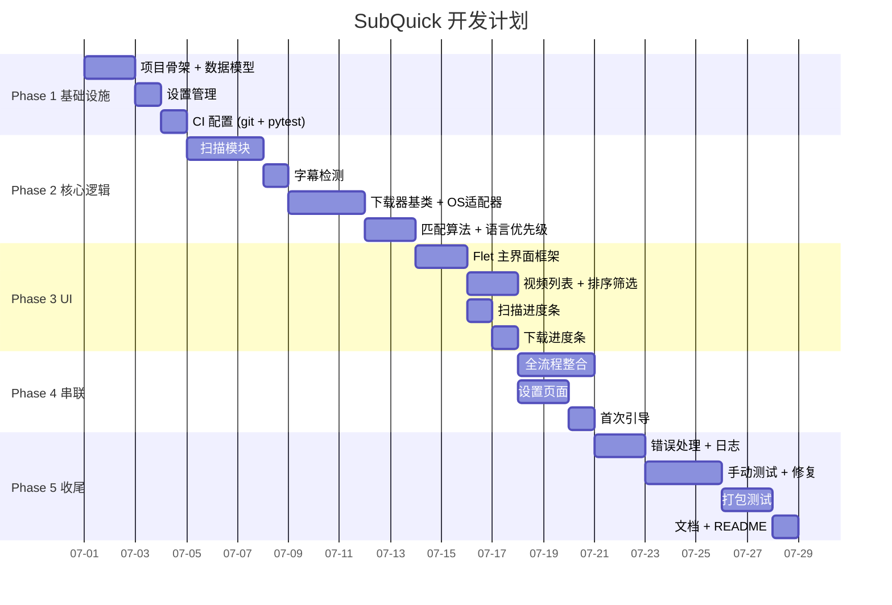

### 9.3 依赖安装

```bash
# 核心依赖
pip install flet requests

# 开发依赖
pip install pytest pytest-mock

# 打包
pip install pyinstaller
```

**requirements.txt:**
```
flet>=0.85.0
requests>=2.28.0
```

---

## 10. 更新设计

### 10.1 版本号规范

遵循 **语义化版本 2.0**：

```
主版本.次版本.修订号
  │      │      └── bug 修复、小调整
  │      └────────── 功能新增、向后兼容
  └─────────────── 架构变更、不兼容更新
```

示例：`v1.0.0` → `v1.1.0` → `v1.2.0` → `v2.0.0`

### 10.2 更新检查机制

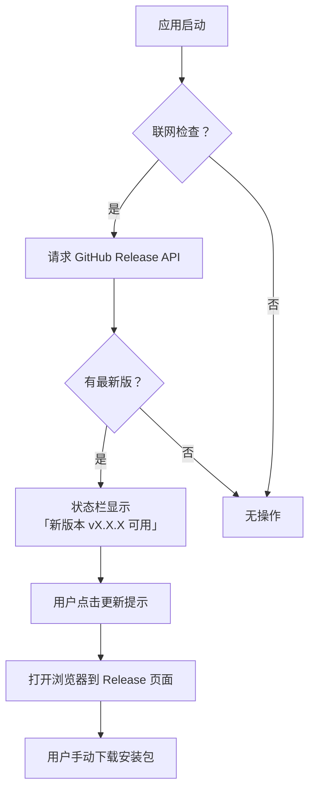

**技术实现：**
- 请求 `https://api.github.com/repos/{owner}/SubQuick/releases/latest`
- 比较 `tag_name` 与本地版本号
- 网络超时 5 秒，不影响启动速度

### 10.3 设置兼容性

用户设置 `user_settings.json` 包含 `version` 字段：

```json
{
    "version": "1.0.0",
    "language_priority": ["zh", "en"],
    "max_subtitles_per_video": 3,
    ...
}
```

升级时对比版本号，支持设置迁移（向下兼容旧版设置格式）。

---

## 11. 数据库设计

### 11.1 设计原则

- **不引入 SQL 数据库** — 避免第三方依赖，减少打包体积
- 使用 **JSON 文件** 存储持久化数据，Python 原生读写
- 适合 SubQuick 的数据量级（个人用户，文件数百到数千）

### 11.2 用户设置 (`user_settings.json`)

```json
{
    "_version": "1.0.0",
    "_updated_at": "2026-06-28T12:00:00+08:00",

    "video_directories": [
        "D:\\Movies",
        "E:\\TV Series"
    ],
    "video_formats": ["mp4", "mkv", "avi", "mov", "wmv"],

    "language_priority": {
        "primary": "zh",
        "fallback_chain": ["zh", "en"],
        "auto_fallback": true
    },

    "matching": {
        "max_subtitles_per_video": 3,
        "auto_select": true,
        "prefer_hearing_impaired": false
    },

    "subtitle_providers": {
        "opensubtitles": {
            "enabled": true,
            "api_key": "",
            "api_key_validated": false
        }
    },

    "proxy": {
        "enabled": false,
        "type": "http",
        "host": "",
        "port": 0,
        "username": "",
        "password": ""
    },

    "ignore_list": {
        "directories": [],
        "patterns": ["*sample*", "*trailer*"]
    },

    "ui": {
        "theme": "system",         # "system" | "light" | "dark"
        "language": "zh"
    },

    "first_run": true
}
```

### 11.3 下载历史 (`download_history.json`)

```json
{
    "_version": "1.0.0",
    "records": [
        {
            "video_path": "D:\\Movies\\Movie1.mp4",
            "video_hash": "sha256:abc123...",
            "downloaded_at": "2026-06-28T12:30:00+08:00",
            "subtitles": [
                {
                    "provider": "opensubtitles",
                    "subtitle_id": "1234567",
                    "language": "zh",
                    "file_name": "Movie1.chi.srt",
                    "score": 9.5,
                    "download_url": "..."
                }
            ],
            "status": "completed"
        }
    ]
}
```

### 11.4 数据存储位置

| 系统 | 路径 |
|------|------|
| Windows | `%APPDATA%/SubQuick/` |
| macOS | `~/Library/Application Support/SubQuick/` |
| Linux | `~/.config/SubQuick/` |

通过 `appdirs` 或 `os.environ` 获取。

---

## 12. 安全设计

### 12.1 API Key 安全

| 风险 | 措施 |
|------|------|
| API Key 明文存储 | 存储在 `user_settings.json` 中的 `_appdata` 目录（非程序目录），避免被其他应用读取 |
| API Key 泄露 | 仅用于 HTTPS 传输，不在日志中记录完整 Key（只保留前4位用于识别） |
| 他人获取文件 | 依赖系统文件权限保护（Windows 默认其他用户不可访问 `%APPDATA%`） |

### 12.2 网络安全

| 风险 | 措施 |
|------|------|
| HTTPS 中间人 | 所有 API 调用使用 HTTPS + 证书验证 (requests `verify=True`) |
| DNS 劫持 | 使用 requests 默认证书捆绑 |
| 请求超时 | 全局超时 15 秒，避免卡死 |
| 重试策略 | 自动重试 2 次（间隔 1s, 3s），指数退避 |

### 12.3 文件操作安全

| 风险 | 措施 |
|------|------|
| 写入同名文件 | 下载前检查目标文件是否存在，避免覆盖用户已有字幕；提供配置选项「覆盖已存在」 |
| 路径穿越 | 拒绝包含 `../` 的路径（从 API 返回的文件名做 sanitize） |
| 文件编码 | 字幕文件以 UTF-8 写入，兼容 Windows 文件名编码 |

### 12.4 多实例限制

```python
import os, sys, socket

def check_single_instance():
    """使用 socket 监听端口检测是否已有实例运行"""
    try:
        sock = socket.socket(socket.AF_INET, socket.SOCK_STREAM)
        sock.bind(('127.0.0.1', 48901))
        sock.listen()
        # 首次运行，正常启动
        return sock
    except OSError:
        # 端口已被占用 → 已有实例
        sys.exit("SubQuick 已在运行中")
```

### 12.5 安全清单

```
☐ API Key 不硬编码在代码中
☐ API Key 不完整记录到日志
☐ 所有 HTTP 请求使用 HTTPS
☐ 请求超时设置 ≤ 15s
☐ 下载文件路径做 sanitize（防止 ../）
☐ 不覆盖用户已有字幕文件（默认）
☐ 单实例限制
☐ 写入目录使用系统安全目录
```

---

## 13. 错误处理与异常设计

### 13.1 错误分类

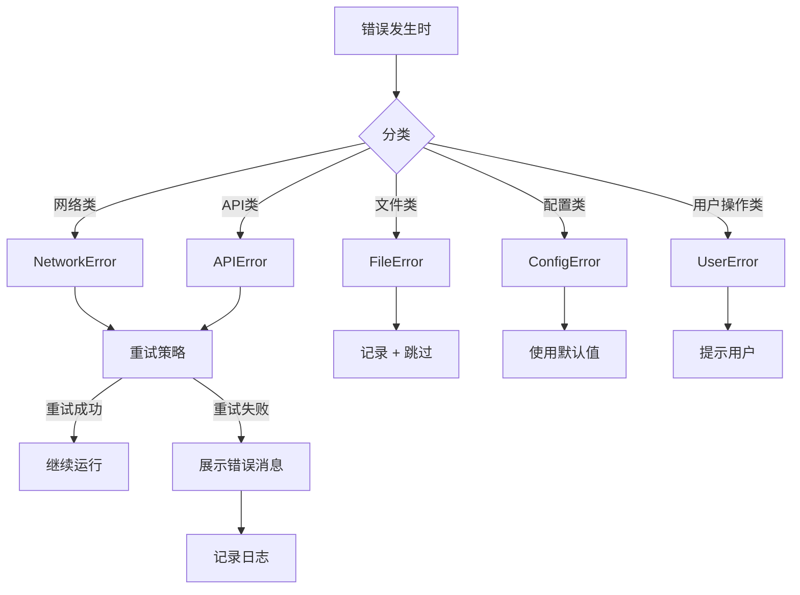

### 13.2 错误码体系

| 错误码 | 分类 | 说明 | 处理方式 |
|--------|------|------|---------|
| NET_001 | 网络 | 连接超时 | 重试2次 → 提示用户检查网络 |
| NET_002 | 网络 | DNS 解析失败 | 提示用户检查网络 |
| NET_003 | 网络 | SSL 证书错误 | 提示用户系统时间是否正确 |
| API_001 | API | API Key 无效 | 引导用户重新设置 Key |
| API_002 | API | API 速率限制 | 等待后重试 |
| API_003 | API | 搜索无结果 | 跳过，标记为「未找到」 |
| API_004 | API | 下载失败 | 记录，继续下一个 |
| FILE_001 | 文件 | 目录不存在 | 提示用户检查路径 |
| FILE_002 | 文件 | 无读取权限 | 提示用户检查权限 |
| FILE_003 | 文件 | 磁盘空间不足 | 警告用户 |
| CFG_001 | 配置 | 设置文件损坏 | 重置为默认值 |
| UI_001 | 用户 | 未选择视频 | 提示「请先勾选视频」|
| UI_002 | 用户 | 未设置 API Key | 引导去设置页面 |

### 13.3 UI 错误展示规范

| 错误级别 | UI 表现 | 适用场景 |
|---------|---------|---------|
| 🟢 信息 | 状态栏文字更新 | 无结果、已跳过 |
| 🟡 警告 | 弹窗 + 按钮继续 | API Key 无效、网络超时 |
| 🔴 错误 | 弹窗 + 中止操作 | 目录不存在、配置损坏 |
| ⚫ 致命 | 弹窗 + 关闭应用 | 应用初始化失败 |

### 13.4 优雅降级策略

- **某个字幕源不可用** → 自动切换到下一个源，状态栏提示
- **某个视频匹配失败** → 跳过该视频，继续处理其他视频，最后汇总失败列表
- **设置文件损坏** → 备份旧文件，生成新默认设置，提示用户重新配置
- **网络中断** → 暂停下载，保留已下载进度，网络恢复后可继续

---

## 14. 日志与监控设计

### 14.1 日志配置

| 配置项 | 值 |
|--------|-----|
| 日志文件 | `%APPDATA%/SubQuick/logs/app.log` |
| 日志级别 | DEBUG（开发）/ INFO（生产） |
| 单个文件大小 | 5 MB |
| 文件轮转 | 保留最近 3 个文件（`app.log`, `app.log.1`, `app.log.2`） |
| 编码 | UTF-8 |

### 14.2 日志格式

```
[2026-06-28 12:30:00,123] [INFO] [scan_service:42] 开始扫描目录: D:\Movies
[2026-06-28 12:30:05,456] [DEBUG] [video_scanner:78] 发现文件: Movie1.mp4 (2.1G)
[2026-06-28 12:30:05,789] [WARNING] [opensubtitles:152] API Key 未配置，跳过搜索
[2026-06-28 12:30:10,012] [ERROR] [manager:203] 下载失败 Movie1.mp4: NET_001 连接超时
[2026-06-28 12:30:15,345] [INFO] [download_service:89] 下载完成: 3/5 成功, 1 失败, 1 跳过
```

### 14.3 日志记录点

| 模块 | 日志事件 | 级别 |
|------|---------|------|
| `scan_service` | 开始扫描 | INFO |
| `scan_service` | 扫描完成 (统计) | INFO |
| `video_scanner` | 发现视频文件 | DEBUG |
| `video_scanner` | 检测到字幕 | DEBUG |
| `download_service` | 开始批量下载 | INFO |
| `download_service` | 批量下载完成 | INFO |
| `manager` | 开始下载单个文件 | DEBUG |
| `manager` | 单个文件下载成功 | INFO |
| `manager` | 单个文件下载失败 | WARNING |
| `opensubtitles` | API 请求/响应 | DEBUG |
| `opensubtitles` | API 错误 | WARNING |
| `settings_service` | 设置已保存 | DEBUG |
| `settings_service` | 设置文件损坏 | ERROR |
| 全局 | 应用启动 | INFO |
| 全局 | 应用退出 | INFO |
| 全局 | 未捕获异常 | CRITICAL |

### 14.4 用户可见状态

日志是给开发者调试用的。用户界面上看到的不是日志，而是：

```
状态栏: "扫描完成 | 50 部缺失字幕 | 上次匹配: 2026-06-28"
进度面板: "下载进度: 75% (2/3 完成)"
当前任务: "Movie1.mp4 → 正在搜索..."
```

### 14.5 日志查看

应用内部提供「查看日志」入口（设置页面中），点击后用系统默认文本编辑器打开日志文件。

---

## 15. 项目命名规范

### 15.1 基础标识

| 项目 | 值 |
|------|-----|
| 项目名称 | SubQuick |
| 项目中文名 | 快速字幕匹配工具 |
| 包名 | subquick |
| PyPI 名称 | (暂不发布 PyPI) |
| GitHub 仓库 | `SubQuick` |
| Windows exe 名 | `SubQuick.exe` |
| 窗口标题 | `SubQuick v1.0.0` |

### 15.2 Python 命名规范

| 类型 | 规范 | 示例 |
|------|------|------|
| 包/模块 | 小写下划线 | `video_scanner.py` |
| 类 | PascalCase | `VideoScanner` |
| 函数/方法 | snake_case | `scan_directory()` |
| 变量 | snake_case | `video_list` |
| 常量 | UPPER_SNAKE | `MAX_SUBTITLES` |
| 私有成员 | 前导下划线 | `_retry_count` |

### 15.3 文件命名规范

| 类型 | 规范 | 示例 |
|------|------|------|
| Python 源码 | 小写下划线 | `subtitle_matcher.py` |
| 测试文件 | `test_` 前缀 | `test_video_scanner.py` |
| 配置文件 | snake_case | `user_settings.json` |
| 资源文件 | 小写 | `icon.png` |

### 15.4 图标与品牌

| 元素 | 设计 |
|------|------|
| 图标设计 | 影片胶卷 + 字幕 `[S]` 标志，蓝色主色调 |
| 图标格式 | `.ico` (Windows) + `.png` (应用内) |
| 窗口名 | `SubQuick - 快速字幕匹配工具` |

---

## 16. 交互设计（界面原型详述）

### 16.1 首页 — 扫描完成状态（16:9 宽屏布局，默认 1440×810）

```
┌──────────────────────────────────────────────────────────────────────────────┐
│  SubQuick - 快速字幕匹配工具                                        v1.0.0 ⚙ │
├──────────────────────────────────────────────────────────────────────────────┤
│ ┌─ 扫描设置 ─────────────────────────────────────────────────────────────┐ │
│ │ 📁 视频目录:  C:\Users\User\Videos                              [📂]   │ │
│ │ 支持的格式: [☑]MP4 [☑]MKV [☑]AVI [☑]MOV [☑]WMV         [▶ 开始扫描] │ │
│ └─────────────────────────────────────────────────────────────────────────┘ │
│                                                                                │
│ ┌─ 扫描结果 ─────────────────────────────────────────────────────────────────┐ │
│ │ [☐ 全选] [筛选: 全部 ▾] [排序: 文件名 ▾]           共 50 部视频, 35 部缺失  │ │
│ │                                                                              │
│ │ ┌────┬──────────────────────┬────────┬────────┬──────┬──────────┬────────┐ │ │
│ │ │ ☑  │ 文件名                │ 格式    │ 大小    │ 时长  │ 字幕状态  │ 目录    │ │ │
│ │ ├────┼──────────────────────┼────────┼────────┼──────┼──────────┼────────┤ │ │
│ │ │ ☑  │ 星际穿越 (2014).mkv  │ MKV    │ 8.2 GB │ 2h49 │ ⚠ 缺失   │ Sci-Fi │ │ │
│ │ │ ☑  │ 盗梦空间 (2010).mp4  │ MP4    │ 3.1 GB │ 2h28 │ ⚠ 缺失   │ Main   │ │ │
│ │ │ ☑  │ 千与千寻 (2001).mkv  │ MKV    │ 2.4 GB │ 2h05 │ ⚠ 缺失   │ Ghibli │ │ │
│ │ │ ☐  │ 你的名字 (2016).mp4  │ MP4    │ 1.8 GB │ 1h46 │ ✓ 已存在  │ Main   │ │ │
│ │ │ ☑  │ 楚门的世界 (1998).avi│ AVI    │ 1.5 GB │ 1h43 │ ⚠ 缺失   │ Main   │ │ │
│ │ │ ☑  │ 肖申克的救赎.mkv     │ MKV    │ 6.7 GB │ 2h22 │ ⚠ 缺失   │ Drama  │ │ │
│ │ │ ☑  │ 这个杀手不太冷.mp4   │ MP4    │ 2.8 GB │ 1h50 │ ⚠ 缺失   │ Main   │ │ │
│ │ │ ☑  │ 哈尔的移动城堡.mkv   │ MKV    │ 3.2 GB │ 1h59 │ ⚠ 缺失   │ Ghibli │ │ │
│ │ │ ☑  │ 疯狂动物城.mp4       │ MP4    │ 2.1 GB │ 1h48 │ ⚠ 缺失   │ Disney │ │ │
│ │ │ ☑  │ 泰坦尼克号.mkv       │ MKV    │ 9.5 GB │ 3h15 │ ⚠ 缺失   │ Main   │ │ │
│ │ └────┴──────────────────────┴────────┴────────┴──────┴──────────┴────────┘ │ │
│ │                                                                              │ │
│ │ [全选] [反选]  已选 9 部 / 共 50 部视频 (35 部缺失)                         │ │
│ └──────────────────────────────────────────────────────────────────────────────┘ │
│                                                                                  │
│ ┌─ 下载操作 ───────────────────────────────────────────────────────────────────┐ │
│ │ [⬇ 一键匹配]  [📋 导出缺失列表]                 字幕数/视频: [3 ▾]         │ │
│ │ ──────────────────────────────────────────────────────────────────────────── │ │
│ │ ✅ 已完成: 7/9 部                                                            │ │
│ │    ├ 星际穿越 (2014).mkv   → 简体中文 + English  (3 个字幕)  ✅             │ │
│ │    ├ 盗梦空间 (2010).mp4   → 简体中文 + English  (2 个字幕)  ✅             │ │
│ │    ├ 千与千寻 (2001).mkv   → 简体中文 + English  (3 个字幕)  ✅             │ │
│ │    └ 共 7 部完成                                                              │ │
│ │ ⏳ 进行中: 肖申克的救赎.mkv  → 正在搜索 OpenSubtitles... (65%)               │ │
│ │ ⚠ 失败: 1 部                                                                │ │
│ │    └ 楚门的世界.avi → API 搜索无结果 (当前语言不可用)                        │ │
│ └──────────────────────────────────────────────────────────────────────────────┘ │
│                                                                                  │
│ ┌─ 状态栏 ───────────────────────────────────────────────────────────────────┐  │
│ │  扫描完成 | 50 部视频 | 35 部缺失字幕 | 上次匹配: 2026-06-28 12:30       │  │
│ └────────────────────────────────────────────────────────────────────────────┘  │
└──────────────────────────────────────────────────────────────────────────────┘
```

### 16.2 设置页面（全屏页面，充分利用 16:9 横向空间双栏布局）

```
┌──────────────────────────────────────────────────────────────────────────────┐
│  ← 返回                                              设置                    │
├──────────────────────────────────────────────────────────────────────────────┤
│ ┌─ 字幕匹配设置 ───────────────────────────┐ ┌─ 字幕源配置 ────────────────┐ │
│ │                                           │ │                            │ │
│ │ 每部视频匹配字幕数                         │ │ OpenSubtitles.com          │ │
│ │ [1] ───●───── 3 ─────── [5]              │ │ API Key:                   │ │
│ │                                           │ │ [********************** ▾] │ │
│ │ 字幕语言优先级                             │ │ [🔍 验证 Key]  状态: ✅ 有效│ │
│ │ 首选语言:  [简体中文 ▾]                    │ │ 没有 Key？[去注册]          │ │
│ │ 降级策略:  [简体中文 → English → 其他 ▾]   │ │                            │ │
│ │ 如首选语言不可用，自动按降级顺序尝试         │ │                            │ │
│ │                                           │ │                            │ │
│ │ 首选 Hearing Impaired 字幕:               │ │                            │ │
│ │ [  ] 是  [●] 否                           │ │                            │ │
│ └───────────────────────────────────────────┘ └────────────────────────────┘ │
│                                                                                │
│ ┌─ 扫描设置 ────────────────────────────────┐ ┌─ 网络设置 ─────────────────┐ │
│ │                                           │ │                            │ │
│ │ 支持扫描的视频格式:                         │ │ 使用代理:                   │ │
│ │ [☑] MP4  [☑] MKV  [☑] AVI                 │ │ [●] 否  [ ] HTTP  [ ] SOCKS5│ │
│ │ [☑] MOV  [☑] WMV                           │ │ 代理地址:                   │ │
│ │                                           │ │ [___________________:____] │ │
│ │ 忽略列表:                                   │ │ 认证:                      │ │
│ │ [*sample*] [*trailer*]  [＋ 添加]          │ │ [______________] [______]  │ │
│ │                                           │ │                            │ │
│ │ 忽略目录:                                   │ └────────────────────────────┘ │
│ │ [D:\Movies\Sample]               [✕]     │                               │
│ │ [D:\Movies\Extras]                [✕]     │ ┌─ 其他 ─────────────────────┐ │
│ │ [+ 添加目录]                                │ │                            │ │
│ └───────────────────────────────────────────┘ │ 界面主题:  [跟随系统 ▾]      │ │
│                                               │ 打开日志目录                  │ │
│                                               │ 关于 SubQuick                 │ │
│                                               │ 版本: v1.0.0                 │ │
│                                               └────────────────────────────┘ │
└──────────────────────────────────────────────────────────────────────────────┘
```

### 16.3 手动搜索对话框

```
┌─────────────────────────────────────┐
│  手动搜索字幕                        │
│                                     │
│  视频: 星际穿越.mkv                  │
│  路径: D:\Movies\星际穿越.mkv       │
│  ───────────────────────────────── │
│  搜索关键词: [Interstellar     ] 🔍 │
│  或 IMDb ID:  [tt0816692       ] 🔍 │
│  ───────────────────────────────── │
│                                     │
│  ┌────┬────────────┬──────┬──────┐ │
│  │   #│ 字幕名称    │ 语言 │ 评分 │ │
│  ├────┼────────────┼──────┼──────┤ │
│  │   1│ Interstell…│ 中文 │ 9.5  │ │
│  │   2│ Interstell…│ 中文 │ 8.2  │ │
│  │   3│ Interstell…│ English│9.0  │ │
│  └────┴────────────┴──────┴──────┘ │
│                                     │
│  [下载选中]              [取消]     │
└─────────────────────────────────────┘
```

---

## 附录：依赖汇总

```bash
# 运行环境依赖
pip install flet requests

# 可选依赖（视频时长检测，按需安装）
# pip install ffmpeg-python  # 需要 ffprobe 在 PATH 中

# 开发依赖
pip install pytest pytest-mock

# 打包
pip install pyinstaller
```

**requirements.txt:**
```
flet>=0.85.0
requests>=2.28.0
```

**PyInstaller build.spec**（关键结构）：

```python
# build.spec (PyInstaller)

a = Analysis(
    ['main.py'],
    pathex=[],
    binaries=[],
    datas=[('config/default_settings.json', 'config')],
    hiddenimports=[
        'flet', 'flet.flet', 'flet.auth',
        'requests',
    ],
    hookspath=[],
    hooksconfig={},
    runtime_hooks=[],
    excludes=[
        'tkinter', 'test', 'unittest',
        'pydoc', 'email', 'http.server',
    ],
    noarchive=False,
)

pyz = PYZ(a.pure)

exe = EXE(
    pyz,
    a.scripts,
    a.binaries,
    a.datas,
    [],
    name='SubQuick',
    debug=False,
    strip=False,
    upx=True,
    upx_exclude=[],
    runtime_tmpdir=None,
    console=False,
    icon='resources/icon.ico',
)

# 推荐先使用 --onedir 模式测试，稳定后再切 --onefile
```

---

> **文档结束**
>
> 本文档涵盖了 SubQuick 项目的全部设计内容，按 16 个维度进行了详细规划。
> 如需对某个部分深入讨论，或需要进入编码阶段，请告知。
