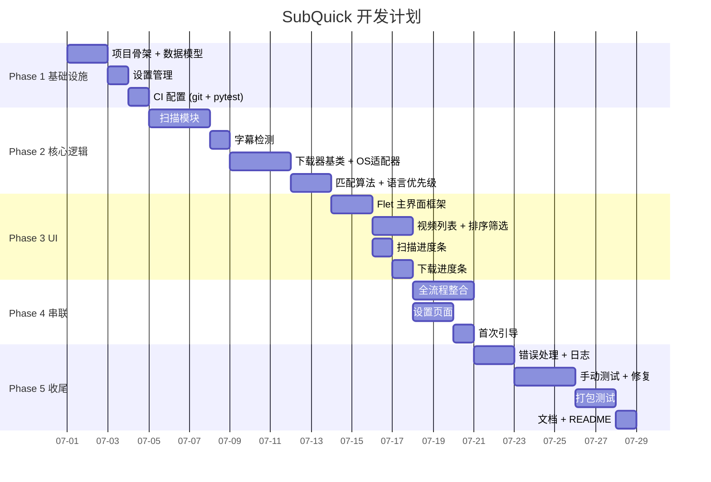

# SubQuick 开发计划

> **项目：** SubQuick - 快速字幕匹配工具
> **技术栈：** Flet (GUI) + PyInstaller (打包)
> **当前阶段：** 设计已完成，进入开发阶段

---

## 1. 开发环境

| 工具 | 版本 | 说明 |
|------|------|------|
| Python | >= 3.9 | Flet 要求 |
| 虚拟环境 | venv（Python 内置） | 开发/调试/打包均在 venv 中进行 |
| Flet | 最新版 | `pip install flet` |
| PyInstaller | 最新版 | `pip install pyinstaller` |
| Git | - | 版本控制 |
| VS Code | - | 推荐 IDE |

### 虚拟环境使用规则

```powershell
# 创建虚拟环境（项目根目录下）
python -m venv .venv

# 激活虚拟环境
.\.venv\Scripts\Activate.ps1

# 安装依赖
pip install -r requirements.txt

# 退出虚拟环境
deactivate
```

> ⚠ 所有开发、调试、打包操作都必须在激活的虚拟环境中执行。`.venv/` 目录已加入 `.gitignore`。

---

## 2. 辅助脚本

| 脚本 | 用途 | 用法 |
|------|------|------|
| `scripts/run_dev.ps1` | 开发运行 | `.\scripts\run_dev.ps1` |
| `scripts/build.ps1` | 打包 exe | `.\scripts\build.ps1` |
| `scripts/lint.ps1` | 代码检查 (ruff) | `.\scripts\lint.ps1` |
| `scripts/test.ps1` | 运行测试 | `.\scripts\test.ps1` |

所有脚本自动激活虚拟环境，无需手动执行 `.\.venv\Scripts\Activate.ps1`。

---

## 3. 开发阶段与里程碑

### 总体甘特图



### Phase 1 — 基础设施（3 天）

| 任务 | 天数 | 产出 | 验收标准 |
|------|------|------|---------|
| 项目骨架 + 数据模型 | 2d | `app/models/video.py`、`subtitle.py`、`task.py`、`settings.py` | 所有 dataclass 定义完成，可 import |
| 设置管理 | 1d | `app/services/settings_service.py` + `config/default_settings.json` | 可读写 JSON 设置文件 |
| CI 配置 | 1d | `tests/` 目录 + pytest 配置 | `pytest tests/` 至少能发现测试文件 |

**Phase 1 完成标志：** ✅ 项目骨架搭建完成，数据模型定义完毕，pytest 可运行

### Phase 2 — 核心逻辑（9 天）

| 任务 | 天数 | 产出 | 验收标准 |
|------|------|------|---------|
| 扫描模块 | 3d | `app/scanner/video_scanner.py` | 递归扫描目录，返回 VideoFile 列表 |
| 字幕检测 | 1d | `app/scanner/subtitle_detector.py` | 正确检测同名字幕文件存在性 |
| 下载器基类 + OS 适配器 | 3d | `app/downloader/base.py` + `opensubtitles.py` + `manager.py` | 可搜索并下载字幕 |
| 匹配算法 + 语言优先级 | 2d | `app/matcher/subtitle_matcher.py` + `language_priority.py` | 按语言优先级排序，限制匹配数量 1-5 |

**Phase 2 完成标志：** ✅ 核心逻辑可脱离 UI 独立测试通过

### Phase 3 — UI 界面（6 天）

| 任务 | 天数 | 产出 | 验收标准 |
|------|------|------|---------|
| Flet 主界面框架 | 2d | `app/ui/app.py` + `pages/main_page.py` | 窗口 1440×810，16:9 布局 |
| 视频列表 + 排序筛选 | 2d | `app/ui/components/video_table.py` | 展示视频数据、列排序、筛选 |
| 扫描进度条 | 1d | `app/ui/components/progress_panel.py` | 扫描时实时更新进度 |
| 下载进度条 | 1d | 同上组件扩展 | 下载时实时更新进度 |

**Phase 3 完成标志：** ✅ UI 可展示虚拟数据，进度条动画正常

### Phase 4 — 流程串联（6 天）

| 任务 | 天数 | 产出 | 验收标准 |
|------|------|------|---------|
| 全流程整合 | 3d | 扫描→列表→勾选→下载 完整链路 | 一次完整操作可走通 |
| 设置页面 | 2d | `app/ui/pages/settings_page.py` | 所有设置项可读可写 |
| 首次引导 | 1d | `app/ui/pages/wizard_page.py` | 首次启动引导配置 API Key |

**Phase 4 完成标志：** ✅ 完整功能可用

### Phase 5 — 收尾（已完成 ✅）

| 任务 | 天数 | 产出 | 验收标准 |
|------|------|------|---------|
| 错误处理 + 日志 | 2d | `app/utils/logging.py` + `main.py` | 错误不崩溃，日志正确记录 |
| 手动测试 + 修复 | 3d | 按测试清单逐项验证 | 测试清单全部通过 |
| 打包测试 | 2d | `build.spec`（已更新） | exe 在无 Python 环境可运行 |
| 文档 + README | 1d | README 更新 | 文档完整 |

**Phase 5 完成标志：** ✅ 发布 v1.0.0

---

## 4. 依赖安装

### 运行依赖

```bash
pip install flet requests
```

### 开发依赖

```bash
pip install pytest pytest-mock ruff
```

### 打包

```bash
pip install pyinstaller
```

### requirements.txt

```
flet>=0.85.0
requests>=2.28.0
pyinstaller>=6.0.0
```

---

## 5. 测试计划

### 单元测试

| 测试文件 | 测试内容 |
|---------|---------|
| `tests/unit/test_scanner.py` | 递归扫描目录、过滤视频格式、检测字幕存在性 |
| `tests/unit/test_file_filter.py` | 格式白名单、忽略列表、排除隐藏文件 |
| `tests/unit/test_language_priority.py` | 语言优先级排序、降级策略（首选→中文→英文） |
| `tests/unit/test_subtitle_matcher.py` | 候选字幕评分、最优选择、匹配数量限制 |
| `tests/unit/test_settings_model.py` | 设置读写、默认值、边界值（匹配数 1-5） |
| `tests/unit/test_network.py` | 代理配置、超时处理、请求重试 |

### 集成测试

| 测试文件 | 测试内容 |
|---------|---------|
| `tests/integration/test_scan_to_list.py` | 扫描完成后数据模型是否正确传递给列表 |
| `tests/integration/test_download_flow.py` | 从选择到下载完成的全流程（mock API） |
| `tests/integration/test_opensubtitles.py` | 实际调用 OpenSubtitles API 验证连通性 |

### 手动测试清单

```
☐ 首次启动 → 引导页面正常展示
☐ 引导页面 → 填写 API Key → 完成 → 进入主界面
☐ 设置目录 → 点浏览 → 选择目录 → 路径显示正确
☐ 输入不存在目录 → 提示错误
☐ 点扫描 → 进度条实时更新 → 扫描完成后列表正确
☐ 扫描 500+ 文件 → 性能正常，不卡死
☐ 列表排序 → 点击各列头 → 排序正确
☐ 勾选 → 全选 → 反选 → 计数正确
☐ 点击一键匹配 → 进度条更新 → 下载完成
☐ 设置匹配数=5 → 下载后确认有 5 个字幕文件
☐ 网络断开时匹配 → 提示错误，列表状态更新
☐ 语言降级测试 → 首选日语不存在 → 自动降级到中文
☐ 设置页面 → 修改所有选项 → 保存 → 重新打开确认
☐ 打包 exe 在无 Python 环境运行
☐ 重复打开 → 单实例限制正常工作
☐ 日志文件正常写入
☐ 深色/浅色模式切换 → 即时生效
☐ 关闭窗口 → 最小化到托盘 → 双击托盘 → 显示窗口
☐ 拖拽窗口边缘 → 窗口自由调整大小
```

---

## 6. 打包发布

### 打包命令

```powershell
.\scripts\build.ps1
```

### 输出目录

```
dist/SubQuick/
├── SubQuick.exe
├── config/
│   └── default_settings.json
├── resources/
│   └── icons/
└── ...（其他运行时文件）
```

### 版本号规范

遵循语义化版本 2.0：`主版本.次版本.修订号`

- `v1.0.0` — 初始发布
- `v1.1.0` — 功能新增
- `v2.0.0` — 架构变更

### 发布流程

1. 更新 `pyproject.toml` 中的版本号
2. 更新 `docs/DESIGN.md` 中的版本号
3. 运行 `.\scripts\test.ps1` 确保全部通过
4. 运行 `.\scripts\build.ps1` 生成 exe
5. 在纯 Windows 环境验证 exe 运行正常
6. 创建 GitHub Release，上传 exe 压缩包

---

## 7. 详细设计参考

完整的 16 维度详细设计请参阅 [`docs/DESIGN.md`](docs/DESIGN.md)，包括：

| 章节 | 内容 |
|------|------|
| 1. 需求分析 | R01-R24 完整需求列表 |
| 2. 用户操作流程 | 主流程 / 设置 / 手动搜索流程图 |
| 3. 代码目录设计 | 完整目录树 |
| 4. 架构设计 | 分层架构 / 数据流 / 模块依赖 |
| 5. 界面主题与配色 | Material Design 3 + 深色/浅色切换 + IconPark 图标 |
| 6. 交互逻辑设计 | 状态机 + 托盘运行 + 窗口调整 |
| 7. 测试设计 | 单元/集成/手动测试 |
| 8. 版权与授权 | MIT 许可 |
| 9. 开发方案 | （本文档内容） |
| 10. 更新设计 | 版本号 / 自动更新 |
| 11. 数据库设计 | JSON 存储方案 |
| 12. 安全设计 | API Key / 网络安全 / 多实例 |
| 13. 错误处理 | 错误码 / 降级策略 |
| 14. 日志监控 | 日志轮转 / 记录点 |
| 15. 项目命名 | 包名 / 类名规范 |
| 16. 交互原型 | 三屏完整布局 |

---

## 8. 当前项目结构

```
SubQuick/
├── main.py                     # 应用入口
├── app/                        # 核心代码
│   ├── __init__.py
│   ├── ui/                     # Flet 页面与控件
│   │   ├── __init__.py
│   │   ├── app.py              # Flet 应用主类
│   │   ├── pages/              # 主页面 / 设置页 / 引导页
│   │   │   ├── __init__.py
│   │   │   ├── main_page.py
│   │   │   ├── settings_page.py
│   │   │   └── wizard_page.py
│   │   └── components/         # 视频表格 / 进度面板 / 对话框
│   │       ├── __init__.py
│   │       ├── video_table.py
│   │       ├── progress_panel.py
│   │       ├── search_dialog.py
│   │       └── status_badge.py
│   ├── scanner/                # 文件扫描 + 字幕检测
│   │   ├── __init__.py
│   │   ├── video_scanner.py
│   │   ├── subtitle_detector.py
│   │   └── file_filter.py
│   ├── downloader/             # 字幕源适配器
│   │   ├── __init__.py
│   │   ├── base.py             # 抽象基类
│   │   ├── opensubtitles.py    # OpenSubtitles.com 适配器
│   │   └── manager.py          # 下载管理器
│   ├── matcher/                # 字幕匹配
│   │   ├── __init__.py
│   │   ├── subtitle_matcher.py
│   │   └── language_priority.py
│   ├── models/                 # 数据模型
│   │   ├── __init__.py
│   │   ├── video.py
│   │   ├── subtitle.py
│   │   ├── task.py
│   │   └── settings.py
│   ├── services/               # 业务服务
│   │   ├── __init__.py
│   │   ├── scan_service.py
│   │   ├── download_service.py
│   │   └── settings_service.py
│   └── utils/                  # 工具函数
│       ├── __init__.py
│       ├── file_utils.py
│       ├── network.py
│       └── hasher.py
├── config/                     # 配置文件
│   └── default_settings.json
├── resources/                  # 图标(IconPark SVG)等静态资源
│   ├── icon.png
│   ├── icon.ico
│   └── logo.png
├── scripts/                    # PowerShell 辅助脚本
│   ├── run_dev.ps1
│   ├── build.ps1
│   ├── lint.ps1
│   └── test.ps1
├── tests/                      # 测试
│   ├── __init__.py
│   ├── conftest.py
│   ├── unit/
│   │   ├── __init__.py
│   │   ├── test_scanner.py
│   │   ├── test_matcher.py
│   │   ├── test_file_filter.py
│   │   └── test_language_priority.py
│   └── integration/
│       ├── __init__.py
│       ├── test_opensubtitles.py
│       └── test_download_flow.py
├── docs/                       # 文档
│   └── DESIGN.md
├── requirements.txt
├── pyproject.toml
├── build.spec
├── README.md
└── LICENSE
```

> **下一步：** 从 Phase 1 开始，完成数据模型定义 → 设置管理 → 测试配置。
